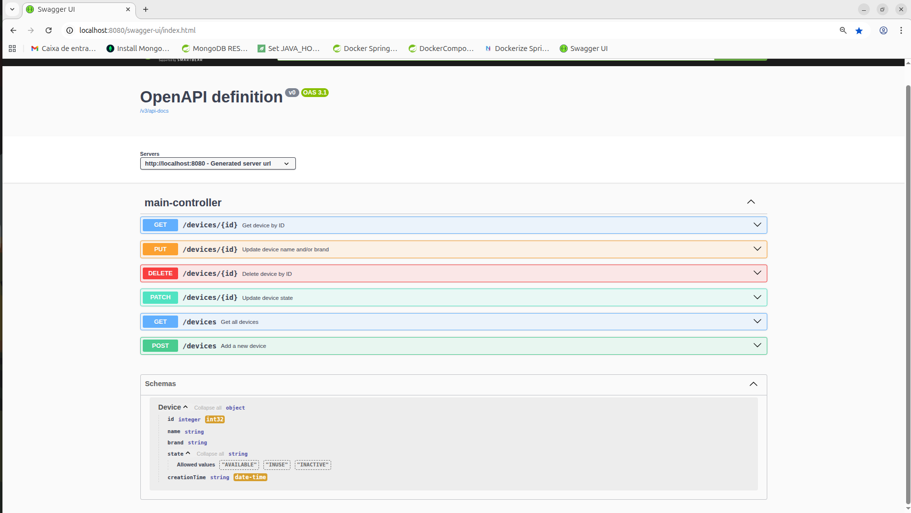

# ESIM-RESTAPI-springboot-mysql-dockercompose
API REST Project, developed with SpringBoot, MySQL and DockerCompose

To use this project, you will need docker (and docker compose)

Build Maven:
```
./mvnw clean install
```

Docker Compose Build and Run:
```
docker compose build
docker compose up -V
```

Use if you want to clean docker compose volumes:
```
docker compose down -v
```


Link to Swagger:
http://localhost:8080/swagger-ui/index.html



The Swagger have some detail on the API Endpoints, their functions, params, and expected responses


------
Future Improvements - Testing:
 - Remove the Mock, and start using the real DeviceRepository with an in-memory database like H2.
 - Add more tests for edge cases and error handling.
 - Add TestContainers for containers and integration tests
 - Use SonarQube in every deploy with GitHub Actions (CI/CD)
 - Integrate the project with a Dynamic Testing Tool, which would send HTTP Requests to the REST API Endpoints while the application is running
   
/*
PS: My Git Email and Git Username wasn't properly configured in my git binary (i was using hidden@mail.com as email), and for some reason github understood it as someone else profile called stefan-koehler, but in fact it was me. (i needed to properly setup the tools prior to this challenge, like the github credentials)
*/
